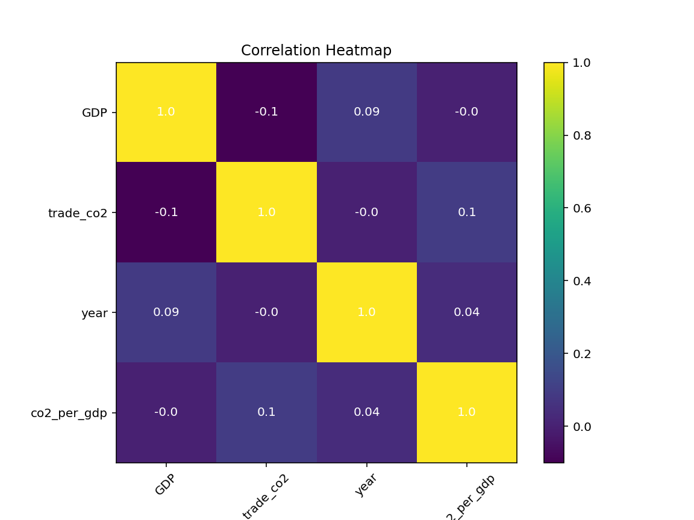
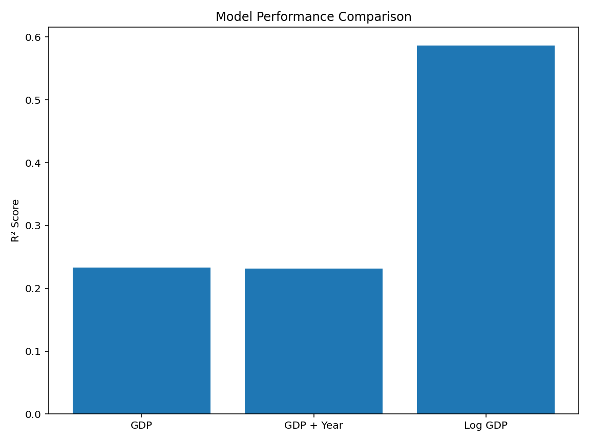
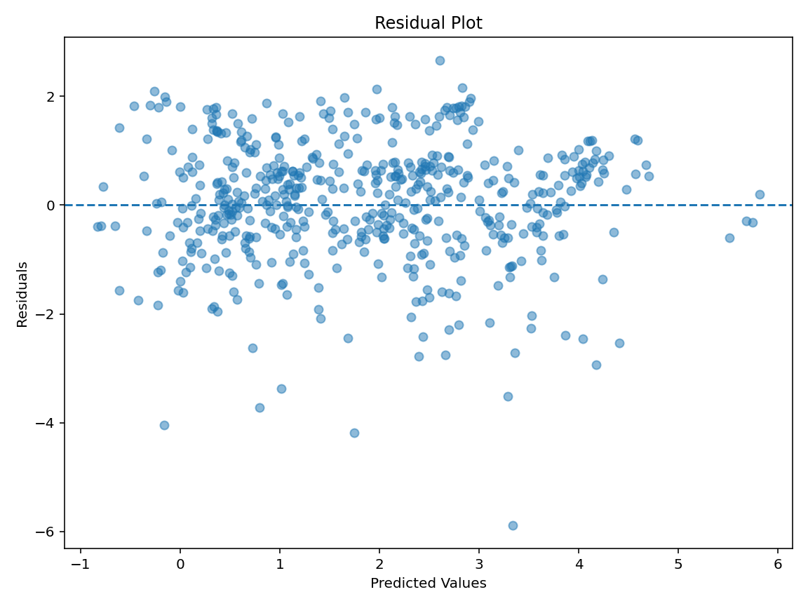

# GDP & Trade CO₂ Emissions Analysis

Python | Data Analysis | Machine Learning | Climate Economics

---

## Project Overview

This project investigates the relationship between **GDP** and **trade-related CO₂ emissions** across countries using **Python, exploratory data analysis, and regression modelling**.

The objective was to examine whether economic output can explain trade-related emissions and determine whether feature engineering and data transformation improve predictive performance.

---

## Objectives

- Clean and merge GDP and CO₂ datasets
- Explore relationships between GDP and trade emissions
- Perform exploratory data analysis (EDA)
- Compare multiple regression models
- Evaluate models using **R² scores** and **residual diagnostics**

---

## Tech Stack

- Python
- pandas
- NumPy
- matplotlib
- scikit-learn

---

## Dataset Preparation

Data processing included:

- Loading GDP and CO₂ datasets
- Standardising column names
- Filtering observations from **1950 onwards**
- Removing missing values
- Merging datasets using:

```python
country
year
```

---

## Exploratory Data Analysis

### Correlation Heatmap

A correlation heatmap was produced using:

- GDP
- Trade CO₂
- Year
- CO₂ intensity (`trade_co2 / GDP`)

This was used to identify variable relationships and support modelling decisions.

### Log Relationship Analysis

A log-log relationship plot was created to investigate potential nonlinear behaviour between GDP and trade-related CO₂ emissions.

The transformed relationship appeared substantially stronger than the raw relationship.

---

## Regression Modelling

Three regression approaches were tested.

| Model | R² Score |
|------|------|
| GDP Model | 0.233 |
| GDP + Year Model | 0.232 |
| Log Regression Model | 0.587 |

---

## Key Findings

### GDP alone provides moderate explanatory power

GDP explained approximately **23%** of variation in trade-related CO₂ emissions.

### Adding year produced negligible improvement

Adding **year** as an additional feature resulted in almost identical performance.

This suggests time information added limited explanatory value within this modelling approach.

### Log transformation significantly improved performance

The log-transformed regression model substantially improved predictive power:

```text
R²: 0.233 → 0.587
```

This indicates the relationship between GDP and trade-related CO₂ emissions is likely **nonlinear**.

---

## Residual Diagnostics

Residual analysis was performed using:

- Residual scatter plot
- Residual histogram

These diagnostics were used to evaluate model behaviour and prediction error patterns.

---

## Project Structure

```text
gdp-co2-analysis/
│
├── data/
│   └── raw/
│       ├── co2.csv
│       └── gdp.csv
│
├── outputs/
│   ├── heat_map.png
│   ├── log_regression.png
│   ├── log_relationship.png
│   ├── log_residual.png
│   ├── model_comparison.png
│   ├── residual_histogram.png
│   └── residual_plot.png
│
├── src/
│   ├── analysis/
│   │   ├── analysis.py
│   │   └── heat_map.py
│   │
│   ├── data/
│   │   └── build_dataset.py
│   │
│   └── models/
│       ├── log_regression.py
│       ├── model_comparison.py
│       ├── model_comparison_plot.py
│       ├── residual_analysis.py
│       └── train_model.py
│
├── README.md
└── requirements.txt
```

---

## Example Outputs

### Correlation Heatmap



### Model Comparison



### Residual Diagnostics



---

## Running the Project

Install dependencies:

```bash
pip install -r requirements.txt
```

Run model comparison:

```bash
python src/models/model_comparison.py
```

Run exploratory analysis:

```bash
python src/analysis/analysis.py
```

---

## Future Improvements

Potential future extensions:

- Additional economic indicators
- Country-level modelling
- Tree-based regression models
- Time-series modelling
- Interactive dashboard visualisation

---

## Author

**Geraint Jones**
